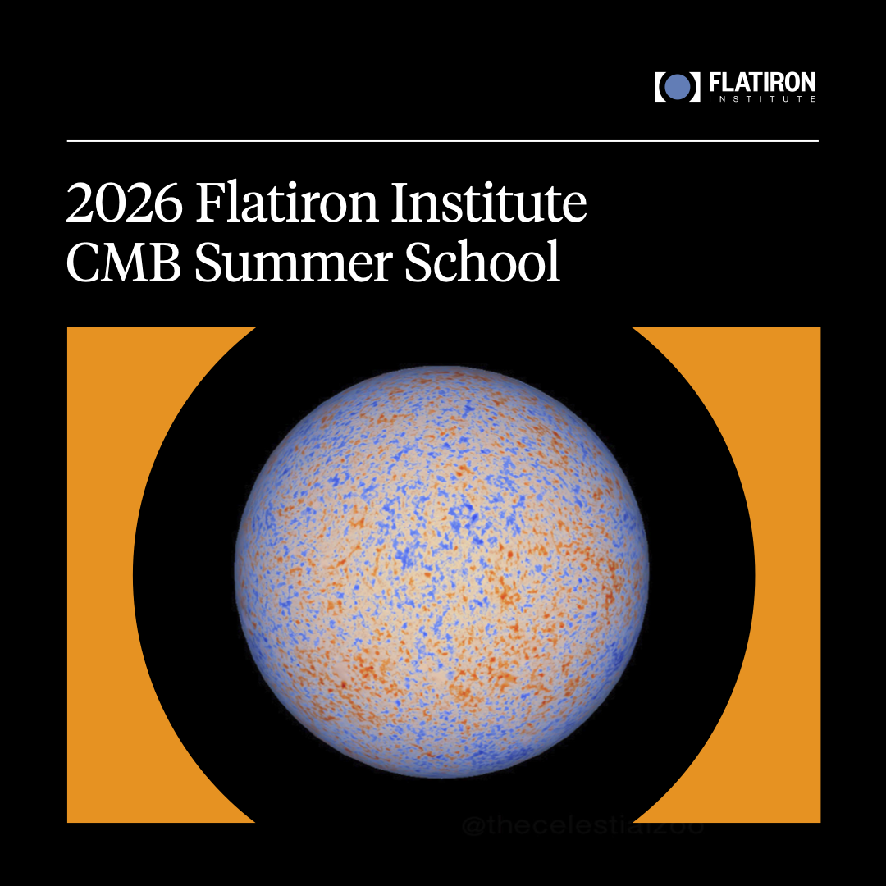

# 2026 Flatiron CMB Summer School

This is the GitHub Repository for the [2026 Flatiron CMB Summer School](https://www.simonsfoundation.org/event/cmb-summer-school-2026/), taking place at the Center for Computational Astrophysics (CCA) from July 13 to 17, 2026, featuring instructors and lecturers from the [Simons Observatory Collaboration](https://simonsobservatory.org/).

## School Curriculum and Format
The school features a mixture of presentation-based lectures and notebook-based interactive sessions.

### Lectures
<!-- Add links to presentations and videos -->
- CMB Data Analysis Overview - Mat Madhavacheril (U Penn)
- Overview of the CMB Field - Suzanne Staggs (Princeton)
- Machine Learning and Simulations - Adrian Bayer (CCA/Simons Foundation)

### Notebooks
<!-- Add links to presentations and videos -->
- Simulating the CMB - Susanna Azzoni (Princeton)
- Simulating SZ and Point Sources - Mat Madhavacheril (U Penn)
- [Modeling Instrumental Noise and Beams](https://github.com/flatironinstitute/2026-flatiron-cmb-summer-school/blob/main/notebooks/CMB_School_modeling_noise_and_beams.ipynb) - Nadia Dachlythra (Università degli Studi di Milano-Bicocca)
- [Power Spectrum Analysis](https://github.com/flatironinstitute/2026-flatiron-cmb-summer-school/blob/main/notebooks/CMB_School_Power_Spectrum_Analysis.ipynb) - Merry Duparc (Université Paris-Saclay)
- [CMB Polarization](https://github.com/flatironinstitute/2026-flatiron-cmb-summer-school/blob/main/notebooks/CMB_School_Power_Spectrum_Analysis.ipynb) - Simone Aiola (CCA/Simons Foundation)
- [Lensing Simulation](https://github.com/flatironinstitute/2026-flatiron-cmb-summer-school/blob/main/notebooks/CMB_School_Lensing_Simulation.ipynb) - Irene Abril Cabezas (University of Cambridge)
- [Lensing Reconstruction](https://github.com/flatironinstitute/2026-flatiron-cmb-summer-school/blob/main/notebooks/CMB_School_Lensing_Reconstruction.ipynb) - Irene Abril Cabezas (University of Cambridge)
- [CMB Mapmaking](https://github.com/flatironinstitute/2026-flatiron-cmb-summer-school/blob/main/notebooks/CMB_School_Mapmaking.ipynb) - Simone Aiola (CCA/Simons Foundation)
- [Machine Learning and Simulations](https://github.com/flatironinstitute/2026-flatiron-cmb-summer-school/blob/main/notebooks/CMB_School_Machine_Learning.ipynb) - Adrian Bayer (CCA/Simons Foundation)
- [Real Experiment Beams](https://github.com/flatironinstitute/2026-flatiron-cmb-summer-school/blob/main/notebooks/CMB_Beam_Systematics.ipynb) - Nadia Dachlythra (Università degli Studi di Milano-Bicocca)
- B-modes - Susanna Azzoni (Princeton)
- [Y-map and Cross-Correlations](https://github.com/flatironinstitute/2026-flatiron-cmb-summer-school/blob/main/notebooks/CMB_School_ymap.ipynb) - Ola Kusiak (University of Cambridge)
- Pixell and ACT Data - Zach Atkins (U Penn) 

## Acknoledgments
Some of the material presented in this school heavily leveraged the publicly available resources from Jeff McMahon (U Chicago) for the [2024 ACT-SPT Analysis School](https://sites.google.com/uchicago.edu/act-sptcmbanalysissummersc/home) and the [ACT DR6 Notebooks](https://github.com/ACTCollaboration/DR6_Notebooks) from the [ACT Collaboration](https://act.princeton.edu/) (see acknowledgments within each notebook). We also thank the CCA for the financial and logistical support.    